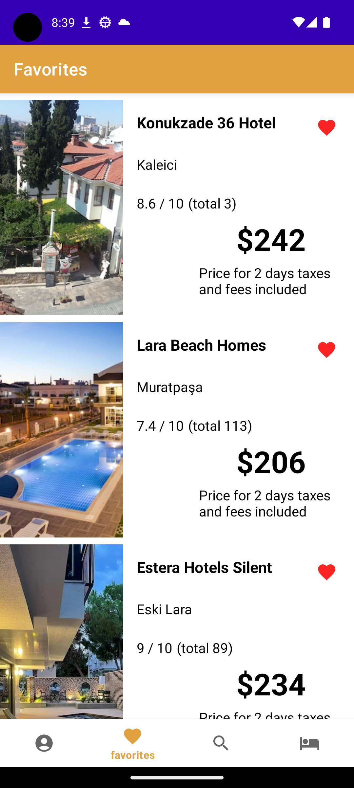

#HotelHive
## Links
- Figma Link: https://www.figma.com/file/21JAYPqS5vuTULC3PKj7OP/HotelHive-team-library?type=design&node-id=0%3A1&t=uLyIkSoICgDvfm5j-1
## Features

- User Registration and Authentication:
    - Users can create accounts and log in to the app.
    - Google Sign-In functionality is integrated for easy login using Google accounts.

- User Profile Management:
    - Users can view and update their profile information, such as name and birthdate.
    - Profile pictures can be uploaded and stored using Firebase Storage.

- Hotel Search:
    - Users can search for hotels based on various criteria such as location, date and guest number.
    - Search results are displayed with detailed information about each hotel.
    - Detailed hotel images and review scores.

- Date Filtering:
    - Users can specify the desired check-in and check-out dates to filter hotel search results based on availability.

- Adding Hotels to Favorites:
    - Users can add hotels to their favorites list for easy access.
    - Favorite hotels are stored in Firebase database.

- Specifying Guest Count:
    - Users can specify the number of guests for their reservation.
    - The guest count is considered during the booking process.

- Making Reservations:
    - Users can make reservations for selected hotels.
    - Reservation details are stored in the Firebase database.

- Cancelling Reservations:
    - Users can cancel their existing reservations.
    - Cancelled reservations are removed from the Firebase database.
    - 
## Screenshots From Project
- 
- 
- 
- 
- 
- 
- 
- 
- 

## Technologies Used

- Firebase Authentication: Used for user registration, login, and profile management.
- Firebase Realtime Database: Used to store hotel and reservation data.

## API 
 - Hotels API used in this project. Link : https://rapidapi.com/apidojo/api/hotels4/
